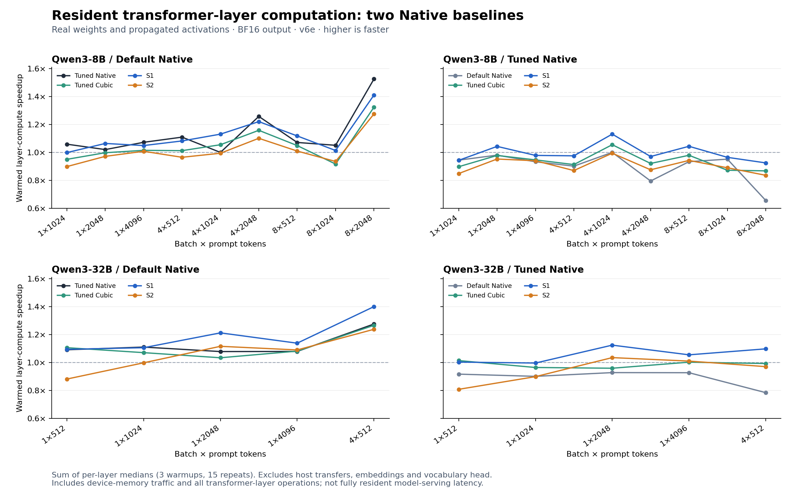

# LLM timings separated by execution scope

Offline reconstruction of all 80 completed BF16 comparisons: Qwen3-8B (10 workloads), Qwen3-32B (5), and Qwen3-14B (1). No TPU was allocated or benchmark rerun. All recorded predictive-quality gates passed. The campaign remains paused.

The headline integration measurement below is the warmed transformer-layer aggregate. Removing host transfers does not remove device-memory reads/writes, projection epilogues, attention, normalization or residual work. It establishes integrated block-compute performance, not an uninterrupted resident-model serving latency.

| Measurement | Available workloads | Five algorithms? | Evidence |
|---|---:|---|---|
| Isolated fused projections | 16 | Cubic/S1/S2 only | Eight-repeat tuning screens, not independent confirmation |
| Warmed transformer-layer aggregate | 14 | Yes | 3 warmups + 15 repeats per layer, own propagated activations |
| Layer compute during streaming | 16 | Yes | Direct sum of layer intervals in each of 15 streamed rounds |
| Full streamed forward, all-token logits | 16 | Yes | 15 matched rounds, recurring H2D included |
| Fully resident model / generation decode | 0 | No | Cannot reconstruct this deployment from these data |

Qwen8 B1/S512 and Qwen14 B1/S512 predate the separate warmed-layer pass. Their streaming-derived compute timings are retained separately, not substituted into that missing scope.

Ratios above 1 mean faster. Both Default Native and Tuned Native baselines are shown; changing the baseline changes the claim. Resident points are sums of layer medians, with no invented whole-model confidence intervals.

## Warmed transformer-layer aggregate

Sum of individual layer medians; three warmups and 15 synchronized repeats per layer/algorithm. Each algorithm propagates its own hidden states. Weights remain on the device during each block of repeats. Excludes weight H2D, embeddings and vocabulary head. Includes attention, normalization, residuals, projections and device memory traffic. This is not an uninterrupted fully resident whole-model execution.

### Qwen3-8B

| Batch × tokens | Default Native ms | Tuned Native ms | Tuned Cubic ms | S1 ms | S2 ms | S1 / Default speedup | S1 / Tuned speedup | S2 / Tuned speedup |
|---|---:|---:|---:|---:|---:|---:|---:|---:|
| 1 × 1024 | 42.933 | 40.549 | 45.183 | 42.995 | 47.790 | 0.9986× | 0.9431× | 0.8485× |
| 1 × 2048 | 101.815 | 99.806 | 102.046 | 95.690 | 104.787 | 1.0640× | 1.0430× | 0.9525× |
| 1 × 4096 | 318.100 | 296.683 | 313.508 | 303.238 | 315.605 | 1.0490× | 0.9784× | 0.9400× |
| 4 × 512 | 79.583 | 71.744 | 78.604 | 73.555 | 82.477 | 1.0820× | 0.9754× | 0.8699× |
| 4 × 1024 | 139.162 | 139.184 | 131.927 | 123.082 | 140.011 | 1.1306× | 1.1308× | 0.9941× |
| 4 × 2048 | 363.973 | 289.395 | 314.275 | 298.213 | 330.596 | 1.2205× | 0.9704× | 0.8754× |
| 8 × 512 | 159.554 | 148.951 | 152.111 | 142.716 | 158.041 | 1.1180× | 1.0437× | 0.9425× |
| 8 × 1024 | 298.520 | 284.083 | 325.725 | 294.528 | 319.261 | 1.0136× | 0.9645× | 0.8898× |
| 8 × 2048 | 854.007 | 559.849 | 645.218 | 605.421 | 669.729 | 1.4106× | 0.9247× | 0.8359× |

### Qwen3-32B

| Batch × tokens | Default Native ms | Tuned Native ms | Tuned Cubic ms | S1 ms | S2 ms | S1 / Default speedup | S1 / Tuned speedup | S2 / Tuned speedup |
|---|---:|---:|---:|---:|---:|---:|---:|---:|
| 1 × 512 | 82.246 | 75.378 | 74.370 | 75.170 | 93.321 | 1.0941× | 1.0028× | 0.8077× |
| 1 × 1024 | 162.906 | 146.724 | 152.185 | 147.322 | 163.291 | 1.1058× | 0.9959× | 0.8985× |
| 1 × 2048 | 414.637 | 384.552 | 401.081 | 342.061 | 371.606 | 1.2122× | 1.1242× | 1.0348× |
| 1 × 4096 | 1258.262 | 1166.060 | 1163.570 | 1105.460 | 1154.555 | 1.1382× | 1.0548× | 1.0100× |
| 4 × 512 | 316.727 | 248.300 | 250.170 | 226.220 | 255.910 | 1.4001× | 1.0976× | 0.9703× |

## Transformer-layer compute during streaming

For each of 15 complete streamed rounds, sum directly recorded per-layer resident_compute_ms; then take the median of those sums. Excludes recorded layer H2D, embedding and head intervals. Not calculated by subtracting independently computed component medians. Cache/dispatch history differs from the separate warmed resident pass.

### Qwen3-8B

| Batch × tokens | Default Native ms | Tuned Native ms | Tuned Cubic ms | S1 ms | S2 ms | S1 / Default speedup | S1 / Tuned speedup | S2 / Tuned speedup |
|---|---:|---:|---:|---:|---:|---:|---:|---:|
| 1 × 512 | 33.616 | 33.630 | 34.424 | 35.598 | 38.141 | 0.9443× | 0.9447× | 0.8817× |
| 1 × 1024 | 54.339 | 51.229 | 55.696 | 53.662 | 58.324 | 1.0126× | 0.9547× | 0.8784× |
| 1 × 2048 | 112.614 | 110.661 | 109.769 | 105.027 | 114.742 | 1.0722× | 1.0536× | 0.9644× |
| 1 × 4096 | 278.233 | 270.700 | 272.445 | 264.794 | 282.389 | 1.0508× | 1.0223× | 0.9586× |
| 4 × 512 | 90.657 | 83.113 | 89.178 | 84.015 | 92.983 | 1.0791× | 0.9893× | 0.8939× |
| 4 × 1024 | 151.529 | 151.889 | 143.434 | 134.978 | 151.291 | 1.1226× | 1.1253× | 1.0040× |
| 4 × 2048 | 369.364 | 300.977 | 325.409 | 310.232 | 342.568 | 1.1906× | 0.9702× | 0.8786× |
| 8 × 512 | 169.158 | 160.143 | 159.374 | 152.095 | 167.660 | 1.1122× | 1.0529× | 0.9552× |
| 8 × 1024 | 308.615 | 284.518 | 307.792 | 291.795 | 322.742 | 1.0576× | 0.9751× | 0.8816× |
| 8 × 2048 | 813.641 | 568.533 | 649.479 | 614.767 | 680.052 | 1.3235× | 0.9248× | 0.8360× |

### Qwen3-32B

| Batch × tokens | Default Native ms | Tuned Native ms | Tuned Cubic ms | S1 ms | S2 ms | S1 / Default speedup | S1 / Tuned speedup | S2 / Tuned speedup |
|---|---:|---:|---:|---:|---:|---:|---:|---:|
| 1 × 512 | 104.557 | 93.723 | 93.502 | 93.126 | 112.655 | 1.1227× | 1.0064× | 0.8319× |
| 1 × 1024 | 184.090 | 165.275 | 171.023 | 165.289 | 181.503 | 1.1137× | 0.9999× | 0.9106× |
| 1 × 2048 | 408.850 | 382.096 | 380.528 | 359.417 | 388.751 | 1.1375× | 1.0631× | 0.9829× |
| 1 × 4096 | 1237.948 | 1153.224 | 1138.157 | 1029.578 | 1074.814 | 1.2024× | 1.1201× | 1.0730× |
| 4 × 512 | 336.161 | 265.898 | 267.312 | 244.331 | 273.501 | 1.3758× | 1.0883× | 0.9722× |

### Qwen3-14B

| Batch × tokens | Default Native ms | Tuned Native ms | Tuned Cubic ms | S1 ms | S2 ms | S1 / Default speedup | S1 / Tuned speedup | S2 / Tuned speedup |
|---|---:|---:|---:|---:|---:|---:|---:|---:|
| 1 × 512 | 50.722 | 51.082 | 48.541 | 48.369 | 55.253 | 1.0486× | 1.0561× | 0.9245× |

## Full streamed forward, all-token logits

Median of 15 measured complete-forward elapsed times, including serialized recurring layer/head H2D, embeddings and all prompt-token vocabulary logits. Excludes checkpoint loading, compilation, host packing, held-out scoring and error calculations. This is an offloaded all-token-logit prefill workload, not a measurement of generation decode or optimized last-token-only prefill.

### Qwen3-8B

| Batch × tokens | Default Native ms | Tuned Native ms | Tuned Cubic ms | S1 ms | S2 ms | S1 / Default speedup | S1 / Tuned speedup | S2 / Tuned speedup |
|---|---:|---:|---:|---:|---:|---:|---:|---:|
| 1 × 512 | 1421.690 | 1406.324 | 1428.713 | 1400.158 | 1414.569 | 1.0154× | 1.0044× | 0.9942× |
| 1 × 1024 | 1413.536 | 1428.764 | 1422.938 | 1411.874 | 1413.676 | 1.0012× | 1.0120× | 1.0107× |
| 1 × 2048 | 1474.140 | 1468.241 | 1476.678 | 1473.091 | 1492.204 | 1.0007× | 0.9967× | 0.9839× |
| 1 × 4096 | 1687.738 | 1674.340 | 1677.677 | 1664.268 | 1683.461 | 1.0141× | 1.0061× | 0.9946× |
| 4 × 512 | 1457.395 | 1446.691 | 1450.252 | 1442.505 | 1445.554 | 1.0103× | 1.0029× | 1.0008× |
| 4 × 1024 | 1700.122 | 1724.495 | 1714.753 | 1719.143 | 1729.559 | 0.9889× | 1.0031× | 0.9971× |
| 4 × 2048 | 2010.410 | 1920.080 | 1960.339 | 1946.861 | 1968.388 | 1.0326× | 0.9862× | 0.9755× |
| 8 × 512 | 1567.763 | 1557.963 | 1555.538 | 1543.303 | 1555.410 | 1.0158× | 1.0095× | 1.0016× |
| 8 × 1024 | 1776.645 | 1750.992 | 1771.637 | 1754.977 | 1818.319 | 1.0123× | 0.9977× | 0.9630× |
| 8 × 2048 | 2590.914 | 2311.499 | 2404.072 | 2379.099 | 2444.488 | 1.0890× | 0.9716× | 0.9456× |

### Qwen3-32B

| Batch × tokens | Default Native ms | Tuned Native ms | Tuned Cubic ms | S1 ms | S2 ms | S1 / Default speedup | S1 / Tuned speedup | S2 / Tuned speedup |
|---|---:|---:|---:|---:|---:|---:|---:|---:|
| 1 × 512 | 4882.052 | 4881.932 | 4906.437 | 4893.289 | 4925.760 | 0.9977× | 0.9977× | 0.9911× |
| 1 × 1024 | 4998.410 | 4970.388 | 4973.616 | 4982.468 | 5021.079 | 1.0032× | 0.9976× | 0.9899× |
| 1 × 2048 | 5252.882 | 5249.450 | 5189.499 | 5199.615 | 5219.322 | 1.0102× | 1.0096× | 1.0058× |
| 1 × 4096 | 6134.912 | 6013.209 | 6171.033 | 5951.001 | 5972.051 | 1.0309× | 1.0105× | 1.0069× |
| 4 × 512 | 5157.008 | 5110.814 | 5111.793 | 5041.349 | 5111.023 | 1.0229× | 1.0138× | 1.0000× |

### Qwen3-14B

| Batch × tokens | Default Native ms | Tuned Native ms | Tuned Cubic ms | S1 ms | S2 ms | S1 / Default speedup | S1 / Tuned speedup | S2 / Tuned speedup |
|---|---:|---:|---:|---:|---:|---:|---:|---:|
| 1 × 512 | 2294.036 | 2301.515 | 2308.611 | 2296.300 | 2296.375 | 0.9990× | 1.0023× | 1.0022× |

## Numerical costs remain attached to the policy

These held-out errors do not change when the timing scope changes. Perplexity shifts of either sign are not evidence of improved model quality; agreement is against Default Native rather than a downstream task score. Hidden-state and logit errors are diagnostic; they are not all pass/fail gates.

| Model | Algorithm | PPL change range | Top-1 agreement range | Logit relative L2 range | Worst layer relative L2 |
|---|---|---:|---:|---:|---:|
| Qwen3-8B | Tuned Native | -0.113% to +0.119% | 98.36%–100.00% | 0.00%–2.21% | 18.32% |
| Qwen3-8B | Tuned Cubic | -0.443% to +0.086% | 98.29%–99.41% | 1.70%–2.86% | 10.05% |
| Qwen3-8B | S1 | -0.551% to +0.300% | 98.31%–99.12% | 1.92%–3.22% | 10.13% |
| Qwen3-8B | S2 | -0.473% to +0.334% | 97.99%–98.92% | 2.74%–3.92% | 13.64% |
| Qwen3-32B | Tuned Native | -0.345% to +0.209% | 98.44%–98.88% | 2.34%–4.00% | 28.22% |
| Qwen3-32B | Tuned Cubic | -0.102% to +0.180% | 98.29%–99.02% | 2.72%–4.26% | 28.71% |
| Qwen3-32B | S1 | -0.245% to +0.128% | 98.29%–98.73% | 2.98%–4.52% | 14.05% |
| Qwen3-32B | S2 | -0.597% to +0.216% | 97.80%–98.83% | 4.06%–5.43% | 13.97% |
| Qwen3-14B | Tuned Native | +0.000% to +0.000% | 100.00%–100.00% | 0.00%–0.00% | 0.00% |
| Qwen3-14B | Tuned Cubic | +0.277% to +0.277% | 98.83%–98.83% | 1.75%–1.75% | 1.99% |
| Qwen3-14B | S1 | -0.202% to -0.202% | 98.63%–98.63% | 2.12%–2.12% | 2.33% |
| Qwen3-14B | S2 | +0.339% to +0.339% | 98.83%–98.83% | 3.18%–3.18% | 3.79% |

## Available projection evidence

Selected candidates from eight-repeat tuning screens on layer-zero real activations; not independent confirmation. Only custom Cubic/S1/S2 projections were timed in isolation; Native screening used the whole layer. Never use Native whole-layer timing as an isolated-GEMM baseline.

See [projection screening tables](projection_screening.md) and [all selected samples, tiles, shapes and errors](projection_screening.json). Native whole-layer screening records remain in the JSON with their proper scope.

## Interpretation and limits

- Qwen8: S1 beats Tuned Native in 3/9 warmed-layer aggregates; S2 in 0/9. The strongest S1 time reduction is B4/S1024 (11.6%). At B8/S2048, S1 is 1.4106× Default Native but only 0.9247× Tuned Native. Transfers are not the explanation for that resident regression.
- Qwen32: the stronger S1 warmed-compute reductions versus Tuned Native are 11.0% at B1/S2048, 5.2% at B1/S4096 and 8.9% at B4/S512. Against Default Native, B4/S512 reaches approximately 1.400×. These integrated-compute improvements remain valid even when the streamed-forward gain is small.
- The historical parent B8/S1024 experiment is a separate workload/protocol. Its resident-layer result is not invalidated by this streamed-forward report. The current Qwen32 sweep has not completed B8/S1024; do not claim a matched replication from these five workloads.
- A separate warmed pass and layer intervals during streaming need not match: their cache, dispatch and synchronization histories differ. Neither is a full resident model measurement.
- Ordinary last-token-only prefill latency cannot be obtained by subtracting all-token head time. Its execution and memory behavior require a dedicated measurement. No decode timings are available.
- Tuning screens and selected winners are not independent kernel confirmation. The current custom search optimizes isolated projections and reuses Native-selected whole-layer compiler options; this report does not remove that tuning limitation.

Only matched streamed rounds are paired-bootstrap resampled (10000 draws, seed 20261003, percentile 95%, no multiple-comparison adjustment). No whole-model timing confidence interval is invented for the sum of individually warmed layer medians.

[Machine-readable timings, samples, speedups against both baselines, intervals, profiles and all quality errors](measurements.json). [Integrity checks](validation.json).

Input ledger SHA256: `1751c70159a859607741ebf9198ab2f1f626376633ce87df7e71d32f9ade5410`. Executed analysis source and input file hashes are preserved in the surrounding archived run.
